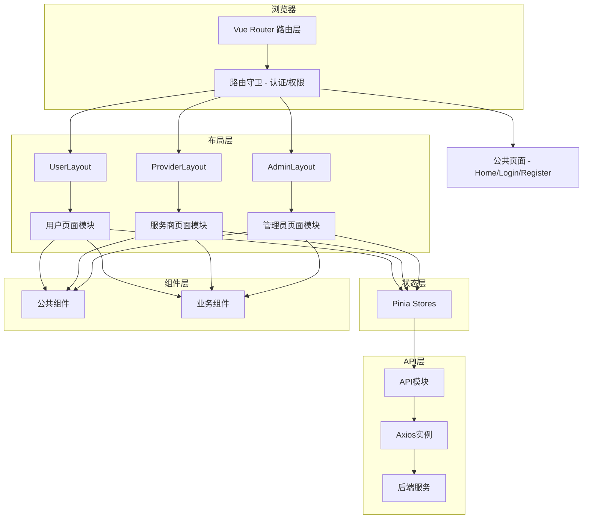
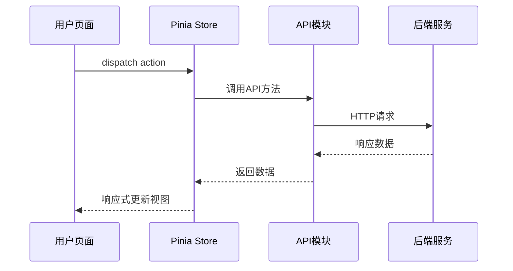

# 技术设计文档：IT服务平台前端系统重构

## 概述

本设计文档基于需求文档中的10项需求，对IT服务平台前端系统进行全面的技术设计。系统基于 Vue 3 + Vite + Ant Design Vue + Pinia 技术栈，采用角色分离的布局架构（User/Provider/Admin），通过模块化路由、集中式状态管理和组件复用策略，实现七大业务模块的完整覆盖。

### 设计目标

- 补全现有系统中缺失的约20个页面组件
- 重构路由与菜单体系，使其与七大模块完全对齐
- 建立统一的公共组件库和业务组件库，提升复用率
- 规范化状态管理和API接口层，降低模块间耦合
- 确保三种角色（User/Provider/Admin）的导航体验一致且权限隔离

### 技术栈确认

| 技术 | 版本 | 用途 |
|------|------|------|
| Vue | 3.5.x | 核心框架 |
| Vue Router | 4.6.x | 路由管理 |
| Pinia | 3.x | 状态管理 |
| Ant Design Vue | 4.2.x | UI组件库 |
| Vite | 7.x | 构建工具 |
| Axios | 1.x | HTTP请求 |
| ECharts | 6.x | 图表可视化 |
| dayjs | 1.x | 日期处理 |

## 架构

### 整体架构图



### 目录结构设计

```
src/
├── api/                          # API接口模块
│   ├── bounty.js                 # 需求悬赏API（已有）
│   ├── service.js                # 服务交易API
│   ├── order.js                  # 订单管理API
│   ├── news.js                   # 资讯API
│   ├── forum.js                  # 论坛API
│   ├── user.js                   # 用户/个人中心API
│   ├── admin.js                  # 管理员API
│   └── common.js                 # 公共API（上传、搜索等）
├── components/
│   ├── common/                   # 通用UI组件
│   │   ├── PlaceholderPage.vue   # 占位页（已有）
│   │   ├── SearchFilter.vue      # 搜索筛选栏
│   │   ├── PaginationWrapper.vue # 分页包装器
│   │   ├── EmptyState.vue        # 空状态
│   │   ├── LoadingSpinner.vue    # 加载动画
│   │   ├── ImageUpload.vue       # 图片上传
│   │   └── RichTextEditor.vue    # 富文本编辑器
│   └── business/                 # 业务组件
│       ├── ServiceCard.vue       # 服务卡片
│       ├── OrderCard.vue         # 订单卡片
│       ├── ArticleCard.vue       # 文章卡片
│       ├── BountyCard.vue        # 悬赏卡片
│       ├── UserAvatar.vue        # 用户头像
│       ├── CommentList.vue       # 评论列表
│       ├── StatusTag.vue         # 状态标签
│       └── AuditResultPanel.vue  # 审核结果面板
├── config/
│   └── menu.js                   # 菜单配置（重构）
├── layouts/
│   ├── UserLayout.vue            # 用户布局（重构）
│   ├── ProviderLayout.vue        # 服务商布局（重构）
│   └── AdminLayout.vue           # 管理员布局（重构）
├── pages/
│   ├── Home.vue                  # 首页（重构）
│   ├── auth/                     # 认证页面
│   ├── error/                    # 错误页面
│   │   ├── 404.vue               # 已有
│   │   └── 403.vue               # 新增
│   ├── user/                     # 用户页面
│   │   ├── news/                 # 资讯模块
│   │   ├── bounty/               # 悬赏模块（补全）
│   │   ├── services/             # 服务模块（补全）
│   │   ├── orders/               # 订单模块（补全）
│   │   ├── forum/                # 论坛模块（补全）
│   │   ├── articles/             # 文章模块
│   │   └── profile/              # 个人中心（补全）
│   ├── provider/                 # 服务商页面
│   │   ├── services/             # 服务管理
│   │   └── orders/               # 订单管理（补全）
│   └── admin/                    # 管理员页面
│       ├── content/              # 内容审核（补全）
│       ├── orders/               # 订单管理
│       └── users/                # 用户管理
├── router/
│   ├── index.js                  # 路由入口（重构）
│   └── modules/
│       ├── router.js             # 公共路由（重构）
│       ├── user.js               # 用户路由（重构）
│       ├── provider.js           # 服务商路由（新增）
│       └── admin.js              # 管理员路由（新增）
└── stores/                       # Pinia状态管理
    ├── auth.js                   # 认证状态
    ├── user.js                   # 用户信息状态
    ├── bounty.js                 # 悬赏模块状态
    ├── service.js                # 服务模块状态
    ├── order.js                  # 订单模块状态
    ├── forum.js                  # 论坛模块状态
    ├── news.js                   # 资讯模块状态
    └── admin.js                  # 管理员模块状态
```

## 组件与接口

### 一、公共组件设计（src/components/common/）

#### 1. SearchFilter 搜索筛选栏

通用的搜索+筛选组合组件，支持关键词搜索、下拉筛选、范围筛选。

```vue
<!-- 接口定义 -->
<SearchFilter
  :filters="filterConfig"       <!-- 筛选项配置数组 -->
  :default-values="defaults"    <!-- 默认筛选值 -->
  @search="handleSearch"        <!-- 搜索事件，返回筛选条件对象 -->
  @reset="handleReset"          <!-- 重置事件 -->
/>
```

Props:
- `filters: Array<{ type: 'input'|'select'|'range'|'date', field: string, label: string, options?: Array }>` — 筛选项配置
- `defaultValues: Object` — 默认值

Events:
- `search(params: Object)` — 触发搜索
- `reset()` — 重置筛选

#### 2. PaginationWrapper 分页包装器

封装 Ant Design 分页组件，统一分页参数和样式。

Props:
- `total: number` — 总条数
- `current: number` — 当前页
- `pageSize: number` — 每页条数

Events:
- `change(page: number, pageSize: number)` — 页码变化

#### 3. EmptyState 空状态

统一的空数据展示组件。

Props:
- `description: string` — 描述文字
- `image: string` — 自定义图片（可选）
- `showAction: boolean` — 是否显示操作按钮

#### 4. ImageUpload 图片上传

封装图片上传逻辑，支持裁剪、预览、多图。

Props:
- `maxCount: number` — 最大上传数量
- `maxSize: number` — 单文件最大大小（MB）
- `accept: string` — 接受的文件类型
- `action: string` — 上传接口地址

Events:
- `change(fileList: Array)` — 文件列表变化
- `success(file: Object)` — 上传成功

#### 5. RichTextEditor 富文本编辑器

基于 textarea 的 Markdown 编辑器（沿用现有 CreateBounty 中的编辑器模式），支持工具栏和预览。

Props:
- `modelValue: string` — 编辑内容（v-model）
- `placeholder: string` — 占位文字
- `maxLength: number` — 最大字符数
- `rows: number` — 行数

Events:
- `update:modelValue(value: string)` — 内容变化

### 二、业务组件设计（src/components/business/）

#### 1. ServiceCard 服务卡片

用于服务列表页、首页推荐区域的服务展示卡片。

Props:
- `service: { id, title, description, coverImage, price, originalPrice, rating, reviews, provider, tags }` — 服务数据
- `mode: 'grid'|'list'` — 展示模式

Events:
- `click(id: number)` — 点击卡片

#### 2. OrderCard 订单卡片

用于订单列表页的订单展示卡片。

Props:
- `order: { id, orderNo, title, status, amount, createdAt, provider?, user? }` — 订单数据
- `role: 'user'|'provider'|'admin'` — 当前角色

Events:
- `click(id: number)` — 点击订单
- `action(type: string, id: number)` — 操作按钮点击

#### 3. ArticleCard 文章/资讯卡片

Props:
- `article: { id, title, summary, coverImage, author, createdAt, views, category }` — 文章数据
- `showCover: boolean` — 是否显示封面

Events:
- `click(id: number)` — 点击文章

#### 4. BountyCard 悬赏卡片

Props:
- `bounty: { id, title, description, budget, budgetType, deadline, status, category, skills, responseCount }` — 悬赏数据

Events:
- `click(id: number)` — 点击悬赏

#### 5. CommentList 评论列表

用于帖子详情、服务详情等页面的评论区域。

Props:
- `comments: Array<{ id, content, author, createdAt, likes, replies }>` — 评论数据
- `loading: boolean` — 加载状态
- `allowReply: boolean` — 是否允许回复

Events:
- `submit(content: string, parentId?: number)` — 提交评论
- `like(commentId: number)` — 点赞评论
- `delete(commentId: number)` — 删除评论

#### 6. StatusTag 状态标签

统一的状态标签组件，根据状态值自动匹配颜色。

Props:
- `status: string` — 状态值
- `type: 'order'|'bounty'|'service'|'audit'` — 业务类型

#### 7. AuditResultPanel 审核结果面板

用于需求审核结果页、服务审核结果页等。

Props:
- `status: 'pending'|'approved'|'rejected'` — 审核状态
- `reason: string` — 驳回原因（rejected时显示）
- `auditTime: string` — 审核时间
- `allowResubmit: boolean` — 是否允许重新提交

Events:
- `resubmit()` — 重新提交

### 三、页面组件设计

#### 需求1：首页与资讯模块

**Home.vue（重构）**
- 布局：独立全屏布局，不使用 Layout 组件
- 区域划分：顶部导航栏 → 轮播Banner → 平台统计 → 热门服务推荐 → 最新资讯 → 页脚
- 已登录用户：顶部导航显示用户头像和快捷入口，替换登录/注册按钮
- 未登录用户：允许浏览公开内容，显示登录引导
- 数据来源：调用 `newsApi.getLatestNews()` 和 `serviceApi.getHotServices()` 获取推荐数据
- 复用组件：`ServiceCard`（热门服务区域）、`ArticleCard`（最新资讯区域）

**NewsList.vue（已有，增强）**
- 布局：顶部搜索筛选栏 + 分类标签栏 + 资讯列表 + 分页
- 筛选：分类筛选（技术、行业、教程等）、关键词搜索
- 列表项：使用 `ArticleCard` 组件，支持网格/列表切换
- 复用组件：`SearchFilter`、`ArticleCard`、`PaginationWrapper`

**NewsDetail.vue（已有，增强）**
- 布局：文章标题区 → 作者信息栏 → 正文内容 → 相关推荐侧边栏
- 展示：标题、正文（Markdown渲染）、发布时间、阅读量、作者信息
- 相关推荐：右侧或底部展示同分类的相关资讯列表
- 复用组件：`ArticleCard`（相关推荐）

#### 需求2：需求悬赏模块

**BountyList.vue（已有，增强）**
- 布局：搜索筛选栏 + 悬赏列表 + 分页
- 筛选：分类、预算范围（Slider）、状态（招募中/进行中/已完成）、排序
- 列表项：使用 `BountyCard` 组件
- 复用组件：`SearchFilter`、`BountyCard`、`PaginationWrapper`

**CreateBounty.vue（已有）**
- 保持现有实现，已包含完整的表单、草稿保存、预览功能

**BountyDetail.vue（已有，增强）**
- 布局：悬赏信息头部 → 需求详情 → 响应列表/投标区域 → 操作按钮
- 发布者视角：查看响应列表、选择中标者
- 服务商视角：提交响应方案
- 复用组件：`StatusTag`、`CommentList`

**BountyDraft.vue（新增）** — 需求草稿页
- 布局：草稿列表表格，包含标题、分类、保存时间、操作列
- 操作：继续编辑（跳转 CreateBounty 并加载草稿数据）、删除草稿
- 数据来源：`bountyApi.getBountyDrafts()`
- 复用组件：`EmptyState`、`PaginationWrapper`

**BountyAuditResult.vue（新增）** — 需求审核结果页
- 布局：审核状态面板 + 需求摘要 + 操作按钮
- 状态展示：待审核（蓝色进度）、已通过（绿色成功）、已驳回（红色警告+驳回原因）
- 操作：已驳回时显示"修改后重新提交"按钮，跳转 CreateBounty 编辑页
- 复用组件：`AuditResultPanel`

#### 需求3：服务交易模块

**ServiceList.vue（已有，保持）**
- 已实现完整的搜索筛选、网格/列表切换、分页功能

**ServiceDetail.vue（已有，增强）**
- 布局：服务封面+基本信息 → 详细描述 → 提供方信息 → 用户评价 → 购买按钮
- 购买按钮：点击跳转至 `ServicePurchase` 页面
- 复用组件：`CommentList`（用户评价）、`StatusTag`

**CreateService.vue / EditService.vue（已有）**
- 保持现有实现

**ServiceManage.vue（已有）**
- 服务商的服务管理列表

**ServicePurchase.vue（新增）** — 服务购买/支付页
- 布局：订单确认区（服务信息摘要、数量、总价）→ 支付方式选择 → 确认支付按钮
- 支付方式：支付宝、微信支付、余额支付（Radio选择）
- 数据流：从路由参数获取 serviceId，调用 `serviceApi.getServiceDetail()` 加载服务信息
- 提交：调用 `orderApi.createOrder()` 创建订单

**ServiceAuditResult.vue（新增）** — 服务审核结果页
- 布局：与 BountyAuditResult 类似，展示服务审核状态
- 复用组件：`AuditResultPanel`

#### 需求4：订单管理模块

**OrderList.vue（已有，增强）** — 用户订单列表
- 布局：状态标签页（Tab切换：全部/待支付/进行中/待验收/已完成/已取消/申诉中）+ 订单列表
- 列表项：使用 `OrderCard` 组件，显示订单号、服务名称、金额、状态、操作按钮
- 复用组件：`OrderCard`、`PaginationWrapper`、`StatusTag`

**OrderManage.vue（Provider，已有，增强）** — 服务商订单管理
- 布局：与用户订单列表类似，增加批量操作功能
- 批量操作：批量确认接单、批量标记发货
- 复用组件：`OrderCard`、`SearchFilter`、`PaginationWrapper`

**OrderDetail.vue（已有，增强）** — 订单详情
- 布局：订单状态进度条 → 订单基本信息 → 服务/需求信息 → 交付物区域 → 操作按钮
- 进度条：使用 `a-steps` 展示订单生命周期（下单→接单→交付→验收→完成）
- 根据订单状态和角色动态显示操作按钮

**OrderDelivery.vue（新增）** — 订单交付页（Provider）
- 布局：订单信息摘要 → 交付物上传区域 → 交付说明 → 提交按钮
- 上传：支持多文件上传（代码、文档、设计稿等）
- 复用组件：`ImageUpload`（扩展为文件上传）

**OrderAcceptance.vue（新增）** — 订单验收页（User）
- 布局：订单信息 → 交付物查看/下载 → 验收评分 → 验收通过/拒绝按钮
- 评分：使用 `a-rate` 对服务质量、沟通效率、交付速度评分
- 拒绝时需填写拒绝原因

**OrderAppeal.vue（新增）** — 订单申诉页（User）
- 布局：订单信息摘要 → 申诉类型选择 → 申诉原因描述 → 证据上传 → 提交按钮
- 申诉类型：服务质量不达标、未按时交付、沟通问题、其他
- 复用组件：`ImageUpload`、`RichTextEditor`

**OrderArbitration.vue（新增）** — 订单仲裁页（Admin）
- 布局：订单信息 → 买方证据 → 卖方证据 → 仲裁意见 → 仲裁结果选择
- 仲裁结果：支持买方（退款）、支持卖方（放款）、部分退款
- 复用组件：`RichTextEditor`

**TransactionHistory.vue（新增）** — 交易记录查询/导出页
- 布局：时间范围选择 + 交易类型筛选 + 交易流水表格 + 导出按钮
- 表格列：交易时间、交易类型、订单号、金额、状态、对方信息
- 导出：使用 `xlsx` 库导出为 Excel 文件
- 复用组件：`SearchFilter`、`PaginationWrapper`

#### 需求5：互动交流模块

**ForumHome.vue（已有，增强）** — 论坛首页
- 布局：板块分类导航 + 热门帖子轮播 + 最新帖子列表
- 板块分类：使用 `a-tabs` 或卡片网格展示各板块
- 复用组件：`SearchFilter`

**ForumCategory.vue（已有）** — 论坛分类页
- 布局：板块信息头部 + 排序标签（热度/最新/精华）+ 帖子列表 + 分页
- 复用组件：`PaginationWrapper`

**PostDetail.vue（已有，增强）** — 帖子详情页
- 布局：帖子标题+作者信息 → 帖子正文 → 点赞/收藏操作栏 → 评论列表
- 操作：点赞、收藏、分享
- 复用组件：`CommentList`、`UserAvatar`

**CreatePost.vue（已有）** — 发布帖子
- 保持现有实现

**MyPosts.vue（新增）** — 我的帖子页
- 布局：帖子列表表格，包含标题、板块、发布时间、浏览量、评论数、操作列
- 操作：编辑、删除
- 复用组件：`PaginationWrapper`、`EmptyState`

**MyLikes.vue（新增）** — 我的点赞页
- 布局：点赞帖子列表，展示帖子标题、作者、点赞时间
- 操作：取消点赞、查看帖子
- 复用组件：`PaginationWrapper`、`EmptyState`

**Favorites.vue（已有，增强）** — 我的收藏页
- 增加标签页切换：收藏的帖子 / 收藏的服务
- 复用组件：`ServiceCard`、`PaginationWrapper`

**Following.vue / Followers.vue（已有）** — 关注/粉丝列表
- 保持现有实现

#### 需求6：个人中心模块

**Profile.vue（已有）** — 个人信息页
- 保持现有实现，支持编辑头像、昵称、简介、联系方式

**AccountSecurity.vue（新增）** — 账号安全页
- 布局：安全设置列表
  - 修改密码：当前密码 + 新密码 + 确认密码
  - 绑定手机号：显示当前绑定状态，支持更换
  - 绑定邮箱：显示当前绑定状态，支持更换
- 每项使用 `a-list-item` 展示，点击展开操作表单

**RoleApplication.vue（新增）** — 角色申请页
- 布局：申请状态展示 + 申请表单
- 未申请：展示服务提供方权益说明 + 申请表单（资质证明上传、服务领域选择、个人简介）
- 审核中：展示审核进度（提交时间、预计审核时间）
- 已通过：展示通过信息，引导切换至 Provider 面板
- 已驳回：展示驳回原因，允许重新申请
- 复用组件：`ImageUpload`、`AuditResultPanel`

**Messages.vue（已有，增强）** — 消息通知页
- 增加消息分类标签页：系统通知 / 订单通知 / 互动通知
- 每条消息：标题、内容摘要、时间、已读/未读状态
- 操作：标记已读、全部已读、删除

**Subscriptions.vue（新增）** — 我的订阅页
- 布局：订阅分类标签页
  - 订阅的服务分类：展示已订阅的分类标签，支持取消订阅
  - 关注的服务提供方：展示已关注的提供方列表
- 复用组件：`UserAvatar`、`PaginationWrapper`

**PrivacySettings.vue（新增）** — 隐私设置页
- 布局：隐私配置列表
  - 个人信息可见性：公开/仅关注者/仅自己（Radio选择）
  - 消息接收偏好：系统通知/订单通知/互动通知（Checkbox）
  - 是否允许被搜索（Switch）
  - 是否显示在线状态（Switch）
- 使用 `a-form` 表单，底部保存按钮

#### 需求7：系统管理模块（管理员专属）

**Dashboard.vue（已有，增强）** — 管理后台首页
- 增加审核待办数量提示

**审核中心（content/ArticleReview.vue 已有，增强）**
- 增加统一审核入口，支持按类型筛选（需求/服务/文章/帖子）
- 复用组件：`SearchFilter`、`StatusTag`

**BountyReview.vue（新增）** — 需求审核页
- 布局：待审核需求列表 + 审核详情弹窗
- 审核操作：通过、驳回（需填写驳回原因）
- 复用组件：`SearchFilter`、`PaginationWrapper`

**UserManage.vue（已有）** — 用户管理
- 保持现有实现

**RoleManage.vue（已有，增强）** — 角色权限分配
- 增加权限配置功能：角色列表 + 权限树形选择

**Statistics.vue（已有，增强）** — 数据统计分析
- 增加图表：用户增长趋势（折线图）、订单量统计（柱状图）、交易额统计（面积图）、服务分类分布（饼图）
- 使用 ECharts 渲染

**Logs.vue（已有）** — 系统日志
- 保持现有实现

**Announcements.vue（已有，增强）** — 公告管理
- 增加公告创建/编辑弹窗、发布/下架/删除操作

**ForumSectionManage.vue（新增）** — 论坛板块管理
- 布局：板块列表表格 + 创建/编辑弹窗
- 表格列：板块名称、描述、排序、帖子数、状态、操作
- 操作：创建、编辑、排序（拖拽排序，使用 vuedraggable）、启用/禁用
- 复用组件：`SearchFilter`

### 四、路由与导航设计（需求8）

#### 路由配置重构

所有路由遵循 `/角色/模块/功能` 命名规范，每个路由配置 `meta.role` 权限元信息。

**公共路由（router/modules/router.js）**

```javascript
export default [
  { path: '/', name: 'Home', component: () => import('@/pages/Home.vue'), meta: { title: '首页' } },
  { path: '/login', name: 'Login', component: () => import('@/pages/auth/Login.vue'), meta: { title: '登录', guest: true } },
  { path: '/register', name: 'Register', component: () => import('@/pages/auth/Register.vue'), meta: { title: '注册', guest: true } },
  { path: '/403', name: 'Forbidden', component: () => import('@/pages/error/403.vue'), meta: { title: '权限不足' } },
]
```

**用户路由（router/modules/user.js）** — 完整路由表

```javascript
export default {
  path: '/user',
  component: () => import('@/layouts/UserLayout.vue'),
  meta: { requiresAuth: true, role: ['user', 'provider'] },
  children: [
    // 资讯模块
    { path: 'news', name: 'NewsList', component: () => import('@/pages/user/news/NewsList.vue'), meta: { title: '资讯大厅' } },
    { path: 'news/:id', name: 'NewsDetail', component: () => import('@/pages/user/news/NewsDetail.vue'), meta: { title: '资讯详情' } },
    // 悬赏模块
    { path: 'bounty', name: 'BountyList', component: () => import('@/pages/user/bounty/BountyList.vue'), meta: { title: '需求悬赏' } },
    { path: 'bounty/create', name: 'CreateBounty', component: () => import('@/pages/user/bounty/CreateBounty.vue'), meta: { title: '发布悬赏' } },
    { path: 'bounty/draft', name: 'BountyDraft', component: () => import('@/pages/user/bounty/BountyDraft.vue'), meta: { title: '需求草稿' } },
    { path: 'bounty/audit/:id', name: 'BountyAuditResult', component: () => import('@/pages/user/bounty/BountyAuditResult.vue'), meta: { title: '审核结果' } },
    { path: 'bounty/:id', name: 'BountyDetail', component: () => import('@/pages/user/bounty/BountyDetail.vue'), meta: { title: '悬赏详情' } },
    // 服务模块
    { path: 'services', name: 'ServiceList', component: () => import('@/pages/user/services/ServiceList.vue'), meta: { title: '服务市场' } },
    { path: 'services/:id', name: 'ServiceDetail', component: () => import('@/pages/user/services/ServiceDetail.vue'), meta: { title: '服务详情' } },
    { path: 'services/:id/purchase', name: 'ServicePurchase', component: () => import('@/pages/user/services/ServicePurchase.vue'), meta: { title: '购买服务' } },
    // 订单模块
    { path: 'orders', name: 'UserOrders', component: () => import('@/pages/user/orders/OrderList.vue'), meta: { title: '我的订单' } },
    { path: 'orders/:id', name: 'UserOrderDetail', component: () => import('@/pages/user/orders/OrderDetail.vue'), meta: { title: '订单详情' } },
    { path: 'orders/:id/acceptance', name: 'OrderAcceptance', component: () => import('@/pages/user/orders/OrderAcceptance.vue'), meta: { title: '订单验收' } },
    { path: 'orders/:id/appeal', name: 'OrderAppeal', component: () => import('@/pages/user/orders/OrderAppeal.vue'), meta: { title: '订单申诉' } },
    { path: 'transactions', name: 'UserTransactions', component: () => import('@/pages/user/orders/TransactionHistory.vue'), meta: { title: '交易记录' } },
    // 论坛模块
    { path: 'forum', name: 'ForumHome', component: () => import('@/pages/user/forum/ForumHome.vue'), meta: { title: '技术论坛' } },
    { path: 'forum/create', name: 'CreatePost', component: () => import('@/pages/user/forum/CreatePost.vue'), meta: { title: '发布帖子' } },
    { path: 'forum/category/:category', name: 'ForumCategory', component: () => import('@/pages/user/forum/ForumCategory.vue'), meta: { title: '论坛分类' } },
    { path: 'forum/post/:id', name: 'PostDetail', component: () => import('@/pages/user/forum/PostDetail.vue'), meta: { title: '帖子详情' } },
    { path: 'forum/my-posts', name: 'MyPosts', component: () => import('@/pages/user/forum/MyPosts.vue'), meta: { title: '我的帖子' } },
    { path: 'forum/my-likes', name: 'MyLikes', component: () => import('@/pages/user/forum/MyLikes.vue'), meta: { title: '我的点赞' } },
    // 文章模块
    { path: 'articles', name: 'ArticleList', component: () => import('@/pages/user/articles/ArticleList.vue'), meta: { title: '我的文章' } },
    { path: 'articles/create', name: 'CreateArticle', component: () => import('@/pages/user/articles/CreateArticle.vue'), meta: { title: '发布文章' } },
    { path: 'articles/edit/:id', name: 'EditArticle', component: () => import('@/pages/user/articles/EditArticle.vue'), meta: { title: '编辑文章' } },
    { path: 'articles/draft', name: 'DraftArticles', component: () => import('@/pages/user/articles/DraftList.vue'), meta: { title: '草稿箱' } },
    // 个人中心
    { path: 'profile', name: 'Profile', component: () => import('@/pages/user/profile/Profile.vue'), meta: { title: '个人信息' } },
    { path: 'profile/security', name: 'AccountSecurity', component: () => import('@/pages/user/profile/AccountSecurity.vue'), meta: { title: '账号安全' } },
    { path: 'profile/role-apply', name: 'RoleApplication', component: () => import('@/pages/user/profile/RoleApplication.vue'), meta: { title: '角色申请' } },
    { path: 'profile/subscriptions', name: 'Subscriptions', component: () => import('@/pages/user/profile/Subscriptions.vue'), meta: { title: '我的订阅' } },
    { path: 'profile/privacy', name: 'PrivacySettings', component: () => import('@/pages/user/profile/PrivacySettings.vue'), meta: { title: '隐私设置' } },
    { path: 'favorites', name: 'Favorites', component: () => import('@/pages/user/profile/Favorites.vue'), meta: { title: '我的收藏' } },
    { path: 'following', name: 'Following', component: () => import('@/pages/user/profile/Following.vue'), meta: { title: '我的关注' } },
    { path: 'followers', name: 'Followers', component: () => import('@/pages/user/profile/Followers.vue'), meta: { title: '我的粉丝' } },
    { path: 'messages', name: 'Messages', component: () => import('@/pages/user/profile/Messages.vue'), meta: { title: '消息中心' } },
  ]
}
```

**服务商路由（router/modules/provider.js）**

```javascript
export default {
  path: '/provider',
  component: () => import('@/layouts/ProviderLayout.vue'),
  meta: { requiresAuth: true, role: ['provider'] },
  children: [
    { path: 'dashboard', name: 'ProviderDashboard', component: () => import('@/pages/provider/Dashboard.vue'), meta: { title: '数据看板' } },
    { path: 'services', name: 'ServiceManage', component: () => import('@/pages/provider/services/ServiceManage.vue'), meta: { title: '服务管理' } },
    { path: 'services/create', name: 'CreateService', component: () => import('@/pages/provider/services/CreateService.vue'), meta: { title: '创建服务' } },
    { path: 'services/edit/:id', name: 'EditService', component: () => import('@/pages/provider/services/EditService.vue'), meta: { title: '编辑服务' } },
    { path: 'services/audit/:id', name: 'ServiceAuditResult', component: () => import('@/pages/provider/services/ServiceAuditResult.vue'), meta: { title: '审核结果' } },
    { path: 'orders', name: 'ProviderOrders', component: () => import('@/pages/provider/orders/OrderManage.vue'), meta: { title: '订单管理' } },
    { path: 'orders/:id', name: 'ProviderOrderDetail', component: () => import('@/pages/provider/orders/OrderDetail.vue'), meta: { title: '订单详情' } },
    { path: 'orders/:id/delivery', name: 'OrderDelivery', component: () => import('@/pages/provider/orders/OrderDelivery.vue'), meta: { title: '订单交付' } },
    { path: 'transactions', name: 'ProviderTransactions', component: () => import('@/pages/provider/Transactions.vue'), meta: { title: '交易记录' } },
  ]
}
```

**管理员路由（router/modules/admin.js）**

```javascript
export default {
  path: '/admin',
  component: () => import('@/layouts/AdminLayout.vue'),
  meta: { requiresAuth: true, role: ['admin'] },
  children: [
    { path: 'dashboard', name: 'AdminDashboard', component: () => import('@/pages/admin/Dashboard.vue'), meta: { title: '管理后台' } },
    { path: 'users', name: 'UserManage', component: () => import('@/pages/admin/users/UserManage.vue'), meta: { title: '用户管理' } },
    { path: 'users/:id', name: 'UserDetail', component: () => import('@/pages/admin/users/UserDetail.vue'), meta: { title: '用户详情' } },
    { path: 'roles', name: 'RoleManage', component: () => import('@/pages/admin/users/RoleManage.vue'), meta: { title: '角色管理' } },
    { path: 'content/articles', name: 'ArticleReview', component: () => import('@/pages/admin/content/ArticleReview.vue'), meta: { title: '文章审核' } },
    { path: 'content/services', name: 'ServiceReview', component: () => import('@/pages/admin/content/ServiceReview.vue'), meta: { title: '服务审核' } },
    { path: 'content/bounties', name: 'BountyReview', component: () => import('@/pages/admin/content/BountyReview.vue'), meta: { title: '需求审核' } },
    { path: 'content/forum', name: 'ForumManage', component: () => import('@/pages/admin/content/ForumManage.vue'), meta: { title: '论坛管理' } },
    { path: 'content/forum/sections', name: 'ForumSectionManage', component: () => import('@/pages/admin/content/ForumSectionManage.vue'), meta: { title: '板块管理' } },
    { path: 'orders', name: 'AdminOrders', component: () => import('@/pages/admin/orders/OrderManage.vue'), meta: { title: '订单管理' } },
    { path: 'orders/appeals', name: 'AppealHandle', component: () => import('@/pages/admin/orders/AppealHandle.vue'), meta: { title: '申诉处理' } },
    { path: 'orders/:id/arbitration', name: 'OrderArbitration', component: () => import('@/pages/admin/orders/OrderArbitration.vue'), meta: { title: '订单仲裁' } },
    { path: 'statistics', name: 'Statistics', component: () => import('@/pages/admin/Statistics.vue'), meta: { title: '数据统计' } },
    { path: 'logs', name: 'Logs', component: () => import('@/pages/admin/Logs.vue'), meta: { title: '系统日志' } },
    { path: 'announcements', name: 'Announcements', component: () => import('@/pages/admin/Announcements.vue'), meta: { title: '公告管理' } },
  ]
}
```

#### 路由守卫设计

```javascript
router.beforeEach((to, from, next) => {
  // 1. 设置页面标题
  document.title = to.meta.title ? `${to.meta.title} - IT服务平台` : 'IT服务平台'
  
  // 2. 获取认证状态
  const authStore = useAuthStore()
  const isAuthenticated = authStore.isAuthenticated
  
  // 3. 已登录用户访问guest页面 → 重定向到对应首页
  if (to.meta.guest && isAuthenticated) {
    next(getHomeRoute(authStore.userRole))
    return
  }
  
  // 4. 需要认证但未登录 → 重定向到登录页
  if (to.meta.requiresAuth && !isAuthenticated) {
    next({ path: '/login', query: { redirect: to.fullPath } })
    return
  }
  
  // 5. 角色权限检查 → 无权限重定向到403
  if (to.meta.role && isAuthenticated) {
    const requiredRoles = Array.isArray(to.meta.role) ? to.meta.role : [to.meta.role]
    if (!requiredRoles.includes(authStore.userRole)) {
      next('/403')
      return
    }
  }
  
  next()
})
```

#### 菜单配置重构

菜单配置需要与路由完全对齐，为三种角色分别配置完整的侧边栏菜单。

用户菜单新增项：
- 悬赏模块：增加"需求草稿"子菜单
- 论坛模块：增加"我的帖子"、"我的点赞"子菜单
- 个人中心：增加"账号安全"、"角色申请"、"我的订阅"、"隐私设置"子菜单
- 订单模块：增加"交易记录"子菜单

服务商菜单保持不变。

管理员菜单新增项：
- 内容审核：增加"需求审核"子菜单
- 论坛管理：增加"板块管理"子菜单

### 五、页面间数据流与交互方式

#### 核心数据流



#### 关键交互流程

**需求发布→审核→响应流程：**
1. User 在 `CreateBounty` 填写表单 → 调用 `bountyStore.createBounty()` → 跳转 `BountyAuditResult`
2. Admin 在 `BountyReview` 审核 → 调用 `adminStore.reviewBounty()` → 更新审核状态
3. User 在 `BountyAuditResult` 查看结果 → 通过则需求上线，驳回则可修改重提
4. Provider 在 `BountyDetail` 提交响应 → 调用 `bountyStore.bidBounty()`

**服务购买→订单→交付流程：**
1. User 在 `ServiceDetail` 点击购买 → 跳转 `ServicePurchase`
2. User 在 `ServicePurchase` 确认支付 → 调用 `orderStore.createOrder()` → 跳转 `OrderDetail`
3. Provider 在 `OrderDetail` 接单 → 在 `OrderDelivery` 上传交付物
4. User 在 `OrderAcceptance` 验收 → 通过则完成，拒绝则可申诉
5. 申诉时 User 在 `OrderAppeal` 提交 → Admin 在 `OrderArbitration` 仲裁

**角色升级流程：**
1. User 在 `RoleApplication` 提交申请 → 调用 `userStore.applyRole()`
2. Admin 在 `UserManage` 审核 → 调用 `adminStore.approveRole()`
3. 通过后 `authStore` 更新角色 → `Menu_System` 动态切换至 Provider 菜单

## 数据模型

### Pinia Store 模块设计

#### 1. authStore（认证状态）

```javascript
// stores/auth.js
export const useAuthStore = defineStore('auth', {
  state: () => ({
    token: localStorage.getItem('token') || '',
    userInfo: JSON.parse(localStorage.getItem('userInfo') || 'null'),
  }),
  getters: {
    isAuthenticated: (state) => !!state.token,
    userRole: (state) => state.userInfo?.role || 'user',
    userId: (state) => state.userInfo?.id,
  },
  actions: {
    async login(credentials) { /* 登录 */ },
    async logout() { /* 登出，清除token和userInfo */ },
    async refreshUserInfo() { /* 刷新用户信息 */ },
    updateRole(newRole) { /* 角色升级后更新 */ },
  }
})
```

#### 2. bountyStore（悬赏模块）

```javascript
// stores/bounty.js
export const useBountyStore = defineStore('bounty', {
  state: () => ({
    bountyList: [],
    currentBounty: null,
    drafts: [],
    filters: { category: '', status: '', budgetRange: [0, 50000], keyword: '' },
    pagination: { current: 1, pageSize: 10, total: 0 },
    loading: false,
  }),
  actions: {
    async fetchBountyList() { /* 获取悬赏列表 */ },
    async fetchBountyDetail(id) { /* 获取悬赏详情 */ },
    async createBounty(data) { /* 创建悬赏 */ },
    async saveDraft(data) { /* 保存草稿 */ },
    async fetchDrafts() { /* 获取草稿列表 */ },
    async deleteDraft(id) { /* 删除草稿 */ },
    async bidBounty(bountyId, data) { /* 投标 */ },
  }
})
```

#### 3. serviceStore（服务模块）

```javascript
// stores/service.js
export const useServiceStore = defineStore('service', {
  state: () => ({
    serviceList: [],
    currentService: null,
    filters: { category: '', priceRange: [0, 50000], sortBy: 'latest', keyword: '' },
    pagination: { current: 1, pageSize: 12, total: 0 },
    loading: false,
  }),
  actions: {
    async fetchServiceList() { /* 获取服务列表 */ },
    async fetchServiceDetail(id) { /* 获取服务详情 */ },
    async createService(data) { /* 创建服务（Provider） */ },
    async updateService(id, data) { /* 更新服务 */ },
    async purchaseService(serviceId, paymentData) { /* 购买服务 */ },
  }
})
```

#### 4. orderStore（订单模块）

```javascript
// stores/order.js
export const useOrderStore = defineStore('order', {
  state: () => ({
    orderList: [],
    currentOrder: null,
    statusFilter: 'all', // all|pending|processing|delivering|completed|cancelled|appealing
    pagination: { current: 1, pageSize: 10, total: 0 },
    loading: false,
  }),
  actions: {
    async fetchOrderList(role) { /* 根据角色获取订单列表 */ },
    async fetchOrderDetail(id) { /* 获取订单详情 */ },
    async createOrder(data) { /* 创建订单 */ },
    async deliverOrder(id, deliveryData) { /* 提交交付物 */ },
    async acceptOrder(id, acceptData) { /* 验收订单 */ },
    async rejectOrder(id, reason) { /* 拒绝验收 */ },
    async appealOrder(id, appealData) { /* 发起申诉 */ },
    async arbitrateOrder(id, arbitrationData) { /* 仲裁（Admin） */ },
    async fetchTransactions(params) { /* 获取交易记录 */ },
    async exportTransactions(params) { /* 导出交易记录 */ },
  }
})
```

#### 5. forumStore（论坛模块）

```javascript
// stores/forum.js
export const useForumStore = defineStore('forum', {
  state: () => ({
    sections: [],        // 板块列表
    postList: [],        // 帖子列表
    currentPost: null,   // 当前帖子
    myPosts: [],         // 我的帖子
    myLikes: [],         // 我的点赞
    hotPosts: [],        // 热门帖子
    pagination: { current: 1, pageSize: 20, total: 0 },
    loading: false,
  }),
  actions: {
    async fetchSections() { /* 获取板块列表 */ },
    async fetchPostList(sectionId, sortBy) { /* 获取帖子列表 */ },
    async fetchPostDetail(id) { /* 获取帖子详情 */ },
    async createPost(data) { /* 发布帖子 */ },
    async likePost(id) { /* 点赞 */ },
    async favoritePost(id) { /* 收藏 */ },
    async fetchMyPosts() { /* 获取我的帖子 */ },
    async fetchMyLikes() { /* 获取我的点赞 */ },
  }
})
```

#### 6. userStore（用户/个人中心模块）

```javascript
// stores/user.js
export const useUserStore = defineStore('user', {
  state: () => ({
    profile: null,
    messages: [],
    unreadCount: 0,
    subscriptions: { categories: [], providers: [] },
    privacySettings: {},
    roleApplication: null,
  }),
  actions: {
    async fetchProfile() { /* 获取个人信息 */ },
    async updateProfile(data) { /* 更新个人信息 */ },
    async changePassword(data) { /* 修改密码 */ },
    async bindPhone(phone, code) { /* 绑定手机 */ },
    async bindEmail(email, code) { /* 绑定邮箱 */ },
    async applyRole(data) { /* 申请角色升级 */ },
    async fetchMessages(type) { /* 获取消息列表 */ },
    async markAsRead(ids) { /* 标记已读 */ },
    async fetchSubscriptions() { /* 获取订阅列表 */ },
    async updatePrivacySettings(data) { /* 更新隐私设置 */ },
  }
})
```

#### 7. newsStore（资讯模块）

```javascript
// stores/news.js
export const useNewsStore = defineStore('news', {
  state: () => ({
    newsList: [],
    currentNews: null,
    categories: [],
    filters: { category: '', keyword: '' },
    pagination: { current: 1, pageSize: 10, total: 0 },
    loading: false,
  }),
  actions: {
    async fetchNewsList() { /* 获取资讯列表 */ },
    async fetchNewsDetail(id) { /* 获取资讯详情 */ },
    async fetchLatestNews(limit) { /* 获取最新资讯（首页用） */ },
  }
})
```

#### 8. adminStore（管理员模块）

```javascript
// stores/admin.js
export const useAdminStore = defineStore('admin', {
  state: () => ({
    pendingReviews: { bounties: 0, services: 0, articles: 0, posts: 0 },
    statistics: { users: 0, orders: 0, revenue: 0, services: 0 },
    logs: [],
    announcements: [],
    forumSections: [],
  }),
  actions: {
    async fetchDashboardData() { /* 获取仪表盘数据 */ },
    async reviewContent(type, id, action, reason) { /* 审核内容 */ },
    async fetchStatistics(dateRange) { /* 获取统计数据 */ },
    async fetchLogs(params) { /* 获取日志 */ },
    async manageAnnouncement(action, data) { /* 管理公告 */ },
    async manageForumSection(action, data) { /* 管理论坛板块 */ },
  }
})
```

### API 模块设计

每个 API 模块对应一个业务领域，统一使用 `src/utils/request.js` 中的 Axios 实例。

```javascript
// api/service.js — 示例
import request from '@/utils/request'

export const getServiceList = (params) => request.get('/services', { params })
export const getServiceDetail = (id) => request.get(`/services/${id}`)
export const createService = (data) => request.post('/services', data)
export const updateService = (id, data) => request.put(`/services/${id}`, data)
export const deleteService = (id) => request.delete(`/services/${id}`)
export const purchaseService = (id, data) => request.post(`/services/${id}/purchase`, data)

// api/order.js — 示例
export const getOrderList = (params) => request.get('/orders', { params })
export const getOrderDetail = (id) => request.get(`/orders/${id}`)
export const createOrder = (data) => request.post('/orders', data)
export const deliverOrder = (id, data) => request.post(`/orders/${id}/deliver`, data)
export const acceptOrder = (id, data) => request.post(`/orders/${id}/accept`, data)
export const rejectOrder = (id, data) => request.post(`/orders/${id}/reject`, data)
export const appealOrder = (id, data) => request.post(`/orders/${id}/appeal`, data)
export const arbitrateOrder = (id, data) => request.post(`/orders/${id}/arbitrate`, data)
export const getTransactions = (params) => request.get('/transactions', { params })
export const exportTransactions = (params) => request.get('/transactions/export', { params, responseType: 'blob' })
```

## 正确性属性

*属性（Property）是指在系统所有有效执行中都应保持为真的特征或行为——本质上是关于系统应该做什么的形式化陈述。属性是人类可读规范与机器可验证正确性保证之间的桥梁。*

### Property 1: 列表筛选结果一致性

*For any* 列表页面（资讯列表、悬赏列表、服务列表、用户订单列表、服务商订单列表、帖子列表、审核列表、用户管理列表、系统日志列表、交易记录列表）和任意筛选条件组合（分类、状态、价格范围、时间范围、关键词、排序方式），返回的所有结果项都应满足所设定的筛选条件。

**Validates: Requirements 2.4, 3.4, 4.1, 4.2, 5.3, 7.1, 7.2, 7.5, 4.8**

### Property 2: 详情页信息完整性

*For any* 业务实体（资讯、悬赏需求、服务商品、订单、论坛帖子），其详情页渲染结果应包含该实体的所有必要信息字段。具体而言：资讯详情应包含标题、正文、发布时间、阅读量；悬赏详情应包含完整需求信息和响应列表；服务详情应包含服务信息、提供方信息、评价和购买按钮；订单详情应包含订单信息和角色对应的操作按钮；帖子详情应包含内容、评论列表和点赞/收藏操作。

**Validates: Requirements 1.3, 2.5, 3.5, 4.3, 4.7, 5.4**

### Property 3: 草稿保存与恢复的往返一致性

*For any* 有效的悬赏表单数据，保存为草稿后再从草稿列表中加载，应能恢复出与原始数据等价的表单内容。

**Validates: Requirements 2.2**

### Property 4: 服务编辑数据预填充的往返一致性

*For any* 已存在的服务商品，进入编辑页面时预填充的表单数据应与该服务的当前数据一致。

**Validates: Requirements 3.2**

### Property 5: 个人信息编辑的往返一致性

*For any* 用户个人信息修改操作，保存后重新加载个人信息页，应展示更新后的数据。

**Validates: Requirements 6.1**

### Property 6: 审核状态一致性

*For any* 提交审核的内容（悬赏需求或服务商品），审核结果页展示的审核状态应与后端存储的实际审核状态一致。

**Validates: Requirements 2.3, 3.3**

### Property 7: 状态依赖的操作可用性

*For any* 业务实体和其当前状态，页面上展示的操作按钮应与该状态允许的操作完全匹配。具体而言：已发布状态的悬赏应允许服务商投标；进行中状态的订单应为Provider显示交付上传功能；待验收状态的订单应为User显示验收通过/拒绝按钮；审核中状态的角色申请应显示审核进度。

**Validates: Requirements 2.6, 4.4, 4.5, 6.4**

### Property 8: 用户数据隔离

*For any* 用户，其"我的帖子"页面应仅包含该用户发布的帖子，"我的收藏"页面应仅包含该用户收藏的内容，"我的点赞"页面应仅包含该用户点赞的帖子，"关注列表"应仅包含该用户关注的人，"粉丝列表"应仅包含关注该用户的人。

**Validates: Requirements 5.5, 5.6, 5.7, 5.8, 5.9**

### Property 9: 路由配置完整性与权限正确性

*For any* 七大模块中定义的页面，路由表中应存在对应的路由配置，且路由路径遵循 `/角色/模块/功能` 命名规范。同时，每个路由的 `meta.role` 应正确反映该页面的访问权限（User路由允许user和provider，Provider路由仅允许provider，Admin路由仅允许admin）。

**Validates: Requirements 8.1, 8.2**

### Property 10: 菜单与路由的一一对应

*For any* 角色菜单配置中的菜单项，其 `path` 属性应在路由表中存在对应的路由记录。反之，路由表中的每个非动态参数路由也应在对应角色的菜单中有入口。

**Validates: Requirements 8.3**

### Property 11: 路由守卫认证保护

*For any* 配置了 `requiresAuth: true` 的路由，未认证用户访问时应被重定向至登录页。*For any* 配置了 `meta.role` 的路由，不具备所需角色的已认证用户访问时应被重定向至403页面。

**Validates: Requirements 8.5, 8.6**

### Property 12: 首页服务推荐排序

*For any* 首页展示的推荐服务列表，服务卡片应按热度和评分的综合排序规则降序排列。

**Validates: Requirements 1.4**

### Property 13: 角色升级后菜单切换

*For any* 用户，当其角色从 user 升级为 provider 后，导航菜单应立即切换为 Provider 菜单布局，包含数据看板、服务管理、订单管理、交易记录等菜单项。

**Validates: Requirements 6.8**

### Property 14: 消息分类正确性

*For any* 用户的消息列表，每条消息应被正确归类到系统通知、订单通知或互动通知分类中，且按分类筛选时只返回对应类型的消息。

**Validates: Requirements 6.5**

### Property 15: 管理员内容管理往返一致性

*For any* 管理员创建的公告或论坛板块，创建后在管理列表中应能查询到，且数据与创建时提交的数据一致。编辑后重新加载应反映最新修改。

**Validates: Requirements 7.6, 7.7**

### Property 16: Layout组件结构统一性

*For any* 角色布局组件（UserLayout、ProviderLayout、AdminLayout），其渲染输出应均包含顶部导航栏、侧边菜单栏、面包屑导航和主内容区域四个核心区域。

**Validates: Requirements 9.5**

### Property 17: 缺失页面组件存在性

*For any* 需求10中列出的缺失页面（BountyDraft、BountyAuditResult、ServicePurchase、ServiceAuditResult、OrderDelivery、OrderAcceptance、OrderAppeal、OrderArbitration、TransactionHistory、MyPosts、MyLikes、AccountSecurity、RoleApplication、Subscriptions、PrivacySettings、BountyReview、ForumSectionManage、403），对应的 Vue 组件文件应存在且能被正确导入为有效的 Vue 组件。

**Validates: Requirements 10.1, 10.2, 10.3, 10.4, 10.5, 10.6, 10.7, 10.8, 10.9, 10.10, 10.11, 10.12, 10.13**

## 错误处理

### 全局错误处理

#### HTTP 请求错误

在 `src/utils/request.js` 的 Axios 拦截器中统一处理：

| HTTP状态码 | 处理方式 |
|-----------|---------|
| 401 | 清除 token，重定向至登录页，提示"登录已过期" |
| 403 | 提示"权限不足"，不跳转（保持当前页面） |
| 404 | 提示"请求的资源不存在" |
| 422 | 解析后端返回的字段级错误，在表单对应字段下显示 |
| 500 | 提示"服务器错误，请稍后重试" |
| 网络错误 | 提示"网络连接失败，请检查网络" |

#### 路由错误

- 访问不存在的路由 → 显示 404 页面
- 访问无权限的路由 → 显示 403 页面
- 未登录访问受保护路由 → 重定向至登录页，登录后跳回原页面（通过 `query.redirect` 参数）

### 页面级错误处理

#### 表单验证

- 使用 Ant Design Vue 的 `a-form` 内置验证机制
- 必填字段、格式校验（邮箱、手机号）、长度限制在前端实时校验
- 提交时进行完整表单验证，不通过则滚动到第一个错误字段

#### 列表页错误

- API 请求失败时显示错误提示，保留当前筛选条件
- 空数据时使用 `EmptyState` 组件展示友好提示
- 加载中使用 `a-spin` 组件展示加载状态

#### 文件上传错误

- 文件类型不匹配 → 提示"不支持的文件格式"
- 文件大小超限 → 提示"文件大小不能超过 X MB"
- 上传失败 → 提示"上传失败，请重试"，保留已上传的文件

#### 支付流程错误

- 余额不足 → 提示"余额不足，请充值"
- 支付超时 → 提示"支付超时，请重新操作"
- 订单已失效 → 提示"订单已失效"，跳转订单列表

### 状态管理错误处理

- Store action 中统一 try/catch，错误通过 `message.error()` 提示用户
- 关键操作（支付、提交审核）失败时保留用户输入数据，避免数据丢失
- 草稿自动保存失败时降级为 localStorage 本地保存

## 测试策略

### 测试框架选择

- 单元测试：Vitest（与 Vite 生态集成）
- 组件测试：@vue/test-utils + Vitest
- 属性测试（Property-Based Testing）：fast-check
- 端到端测试：Cypress（可选，不在本次重构范围内）

### 单元测试

单元测试聚焦于具体示例、边界情况和错误条件：

1. **路由守卫测试**
   - 未登录用户访问受保护路由被重定向到登录页
   - 已登录用户访问 guest 路由被重定向到首页
   - 无权限用户访问角色限制路由被重定向到 403

2. **Store Action 测试**
   - 各 Store 的 CRUD action 正确调用 API 并更新 state
   - 错误处理：API 失败时 state 不被污染

3. **组件渲染测试**
   - 各业务组件（ServiceCard、OrderCard 等）根据 props 正确渲染
   - 表单组件验证规则正确触发
   - 空状态、加载状态正确展示

4. **工具函数测试**
   - 日期格式化、价格格式化
   - Markdown 渲染函数
   - 文件类型/大小校验

### 属性测试（Property-Based Testing）

使用 fast-check 库实现属性测试，每个属性测试至少运行 100 次迭代。每个测试用注释标注对应的设计文档属性。

标注格式：`Feature: it-service-platform-redesign, Property {number}: {property_text}`

每个正确性属性由一个属性测试实现：

- **Property 1（列表筛选结果一致性）**：生成随机筛选条件和数据集，验证筛选函数返回的结果都满足条件
- **Property 2（详情页信息完整性）**：生成随机业务实体数据，验证详情渲染函数输出包含所有必要字段
- **Property 3（草稿往返一致性）**：生成随机表单数据，序列化后反序列化应得到等价数据
- **Property 4（服务编辑预填充）**：生成随机服务数据，验证编辑页预填充逻辑的正确性
- **Property 5（个人信息编辑往返）**：生成随机用户信息，更新后重新获取应一致
- **Property 6（审核状态一致性）**：生成随机审核状态，验证展示逻辑与实际状态匹配
- **Property 7（状态依赖操作可用性）**：生成随机订单/悬赏状态，验证操作按钮集合与状态规则匹配
- **Property 8（用户数据隔离）**：生成随机用户ID和数据集，验证过滤函数只返回属于该用户的数据
- **Property 9（路由配置完整性）**：遍历所有预期页面，验证路由表中存在对应配置且权限正确
- **Property 10（菜单路由对应）**：遍历菜单配置，验证每个菜单项的 path 在路由表中存在
- **Property 11（路由守卫认证保护）**：生成随机路由和认证状态组合，验证守卫行为正确
- **Property 12（首页推荐排序）**：生成随机服务数据集，验证排序函数输出符合降序规则
- **Property 13（角色升级菜单切换）**：模拟角色变更，验证菜单配置切换正确
- **Property 14（消息分类正确性）**：生成随机消息数据，验证分类函数归类正确
- **Property 15（管理员内容管理往返）**：生成随机公告/板块数据，验证 CRUD 往返一致性
- **Property 16（Layout结构统一性）**：验证三个 Layout 组件渲染输出均包含四个核心区域
- **Property 17（缺失页面存在性）**：验证所有预期页面文件存在且可导入

### 测试覆盖策略

| 测试类型 | 覆盖范围 | 优先级 |
|---------|---------|-------|
| 属性测试 | 17个正确性属性 | 高 |
| 单元测试 | Store actions、工具函数、组件渲染 | 高 |
| 组件测试 | 公共组件、业务组件交互 | 中 |
| 集成测试 | 页面级交互流程 | 中 |

